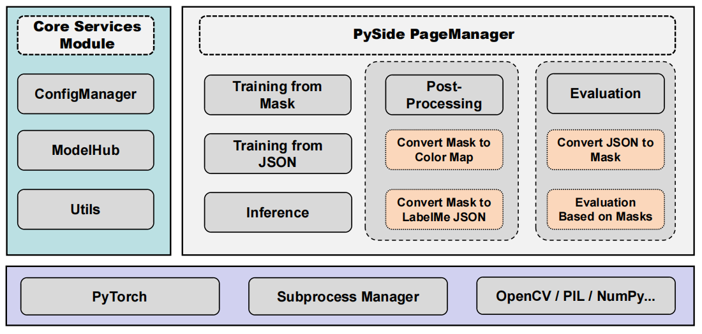
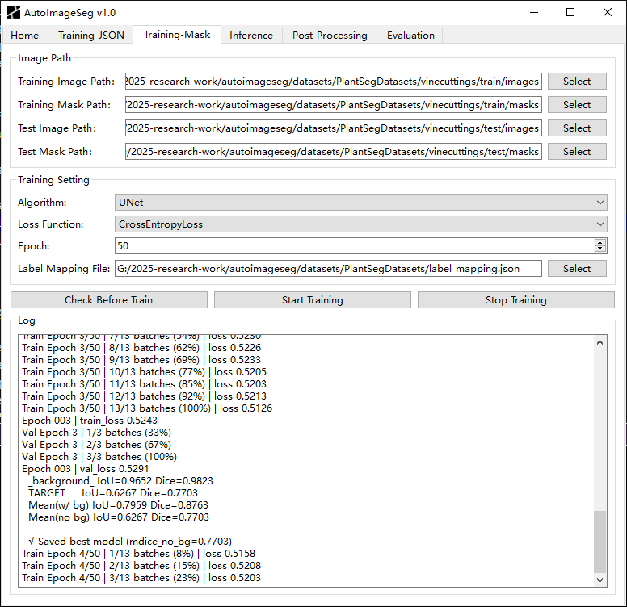
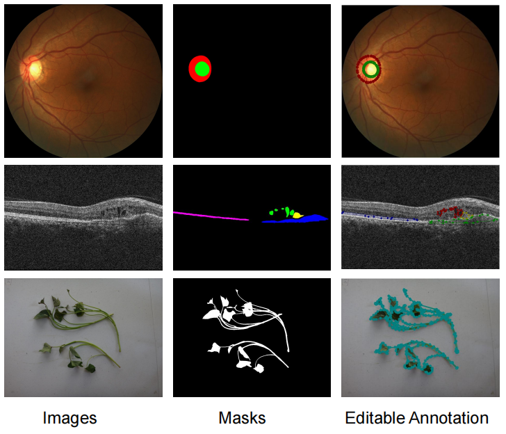

# AutoImageSeg: Zero-code Image Segmentation

## Project Description
AutoImageSeg is a zero-code, open-source image segmentation software that integrates nine mainstream PyTorch models and provides a closed loop of "train-inference-evaluate-back-annotate". Without any programming, users can benchmark models, predict new data, and auto-generate editable LabelMe labels via a graphical interface, enabling rapid iteration and high-quality ground-truth accumulation in small-sample scenarios.

## Features
- **Zero-code rapid benchmarking**: Quickly evaluate different models and obtain domain-specific baseline metrics.
- **Iterative annotation**: From training to editable label files, significantly accelerating the collection of ROI segmentation ground-truth datasets in specialized fields.
- **Environment-agnostic deployment**: One-click training and deployment of PyTorch segmentation models without any development setup, with all code fully open source.

## Getting Started
To get started with AutoImageSeg, you can clone the repository and run main.py.

## Software Architecture

## Software Train Page

## Datasets
The `datasets` folder contains the following datasets:

- **Plant Segmentation Dataset**: A compressed archive of plant segmentation data.  

- **AMD-SD Dataset**: A dataset dedicated to macular OCT images of AMD patients.  
  [Google Drive Link](https://drive.google.com/file/d/10eE6IyV7AWFlvsU6RCioT3yEoakhuI4u/view?usp=sharing)
   [Kaggle](https://www.kaggle.com/datasets/gaoweihao/amd-sd)
   
- **REFUGE Dataset**: A dataset for optic disc and cup segmentation.  
  [Google Drive Link](https://drive.google.com/file/d/1vKsc7jah7bBFb0Eqi-luJUIu3fSEjE-j/view?usp=sharing)
  [grand-challenge](https://refuge.grand-challenge.org/)

## Executable Files

Nuitka is recommended for packaging Python applications into standalone executable files.

### CPU Version

- **Google Drive**: [pytorch-cpu-autoimageseg-v1.zip](https://drive.google.com/file/d/1KmSBrP5MwUPEJE4tAe3rZagi7YcCPs5O/view?usp=sharing)
- **Baidu Cloud Disk**: [pytorch-cpu-autoimageseg-v1.zip](https://pan.baidu.com/s/16bVB5pPOu2E-zx-Q_ERAUQ) (Extraction Code: 5zwq)

### GPU Version

- **Google Drive**: [pytorch-gpu-autoimageseg-v1.zip](https://drive.google.com/file/d/1be8jiUEMyk7Ngh6sF1qo67Fu12VHiQHq/view?usp=sharing)
- **Baidu Cloud Disk**: [pytorch-gpu-autoimageseg-v1.zip](https://pan.baidu.com/s/1i87dSXBIZADjNq0D4W9sAQ) (Extraction Code: u1jq)

These executable files have integrated the required PyTorch versions, so they can be run directly without additional setup.

## Cache and Results

- The software stores cache in the `cache` folder.
- The results of the software are saved in the `results` folder.

## Sample Files

- A sample JSON file for segmentation label mapping is provided in `images/label_mapping_sample.json`.
- The `config.json` file is required for the software to run.

## License
This project is licensed under the Apache License 2.0. See the LICENSE file for details.

## Contact
For any questions or issues, please feel free to contact us at [weihaomeva@163.com]
